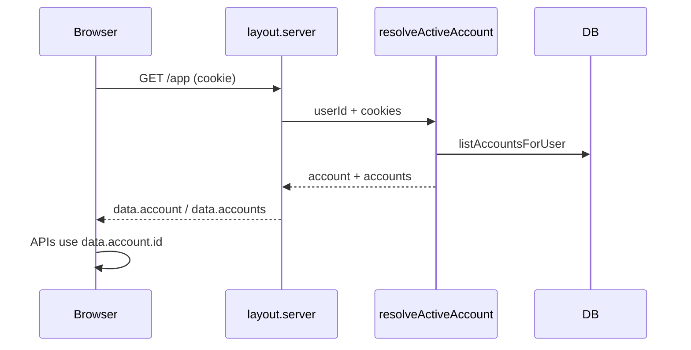

# Architecture: multi-account MVP

## Goal

Make **Active Account** selection drive all protected UI and Control mutations without a schema migration. Reuse existing multi-account DB/API.

## Decisions

### D1 — No new tables

Keep `finance_accounts` / `finance_account_members` as-is. No `is_default` column in MVP.

### D2 — Active Account persistence: HTTP cookie

| Item | Choice |
|------|--------|
| Cookie name | `chhan_active_account_id` |
| Value | Finance Account UUID |
| Flags | `path=/`, `httpOnly`, `sameSite` aligned with app session needs; `secure` in production |
| Validation | On every `(protected)/app` layout load: membership check; if missing/invalid → first account by name (`listAccountsForUser` order) and rewrite cookie |

Rationale: layout is server-loaded; cookie is readable in `+layout.server.ts` without client-only localStorage flash.

### D3 — Layout contract

[`apps/chhan-chhan/src/routes/(protected)/app/+layout.server.ts`](apps/chhan-chhan/src/routes/(protected)/app/+layout.server.ts) returns:

```ts
{
  accounts: Array<{ id, name, currencyCode, timezone, role }>,
  account: /* Active Account row — selected or fallback */,
}
```

Children continue to use `parent().account`. Add `parent().accounts` for the switcher.

Replace bare `getOrCreateDefaultAccount` usage in Control **actions** with: resolve Active Account from cookie (shared helper) or accept `accountId` form field that must match membership.

### D4 — Shared server helper

Add e.g. `resolveActiveAccount(userId, cookies)` in `src/lib/server/finance.ts` (or `account-selection.ts`):

1. `listAccountsForUser`
2. If empty → `createAccount` Personal (existing behavior)
3. Read cookie; if id ∈ memberships → that account
4. Else → `accounts[0]`; set cookie

`setActiveAccount(cookies, accountId)` used by switcher action / API.

### D5 — Create Account wiring

- Prefer SvelteKit form action or small API already at `POST /api/accounts`.
- On success: `setActiveAccount` + `invalidateAll`.
- UI: Account Switcher create form (primary); optional mirror on Control Account panel.

### D6 — Control / import binding

- Stream import already takes `data.account.id` from client — ensure layout `account` is Active.
- Control form actions must **not** call `getOrCreateDefaultAccount` alone; use `resolveActiveAccount`.
- Clear-all, opening balance, currency, metadata CRUD: same.
- Copy: show `account.name` on import and danger zone (UX).

### D7 — Import-in-progress lock

Client-only: while Control `importing === true`, Account Switcher refuses selection (UX). No server lock required for MVP.

### D8 — Authz unchanged

All `/api/accounts/[accountId]/…` continue `getMembershipOrThrow` + `canEdit` for mutations.

## Data flow



## Files likely touched (implementation preview)

| Area | Files |
|------|-------|
| Selection helper | `src/lib/server/finance.ts` or new `account-selection.ts` |
| Layout | `src/routes/(protected)/app/+layout.server.ts` |
| Switcher UI | new component + wire into layout / topbars |
| Control | `control/+page.server.ts`, `control/+page.svelte` |
| Ledger/dashboards | mostly inherit layout; verify no hardcoded default |
| Docs | `FUTURE-TODO.md`, `project-context.md` |

## Non-goals (architecture)

- Paired inter-account transfers schema
- FX rates / consolidated balance
- URL-segment account routing
- Changing importer registry

## Consistency rules for agents

1. Never write finance mutations against an account id that was not membership-validated.
2. Never reintroduce `getOrCreateDefaultAccount` as the only resolver once Active Account exists—use `resolveActiveAccount`.
3. Categories/tags/groups are per-account; do not share ids across accounts in UI caches.
4. BMAD artifacts for this feature stay under `_bmad-output/chhan-chhan/`.

## Next

Human review of PRD + UX + this doc. Then `bmad-create-epics-and-stories` (not started).
