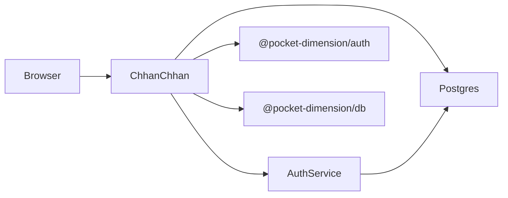
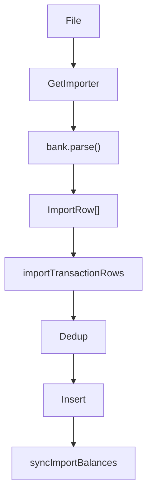

# chhan-chhan — Architecture

**Date:** 2026-08-23

## System context

- **chhan-chhan** (SvelteKit, port 3005): UI + account APIs + import
- **auth-service** (Elysia, 5001): Better Auth sessions/users
- **PostgreSQL:** schemas `auth` + `chhanchhan`

## Request paths

1. **Page loads** — `(protected)/app/+layout.server.ts` ensures user + `getOrCreateDefaultAccount`
2. **Control mutations** — form actions in `control/+page.server.ts` (categories, currency, opening balance, clear-all, legacy import)
3. **Streaming import** — browser posts multipart to `/api/accounts/[id]/transactions/import/stream` (NDJSON progress)
4. **Ledger edits** — PATCH/POST under `/api/accounts/[id]/transactions/...`

## Import pipeline

- Dedup keys: see `transaction-dedup.ts` / `IMPORT.md`
- Reset: `resetAccountTransactions` deletes all txns and nulls account balance (Control Danger zone + CLI `--reset`)

## Authorization

| Helper | Role |
|--------|------|
| `requireUser` | 401 if anonymous |
| `getMembershipOrThrow` | 403 if not a member |
| `canEdit(role)` | owner/editor only |

Viewers can read; Control destructive actions and APIs refuse non-editors.

## Balance model

- **Transaction** optional `balanceMinor` from statement running balance
- **Account** optional opening/current snapshot (`balanceMinor`, `balanceAsOf`) set via Control or advanced by import
- **UI card** `getCurrentBalance` picks newest of account snapshot vs latest txn balance

## Importer extensibility

Implement `BankImporter` (`id`, `label`, `accept`, `parse`), register in `importers/index.ts`. Prefer mirroring ICICI/HDFC PDF chunking + footer strip patterns. Document in `IMPORT.md` and add unit tests.

## Cross-cutting constraints

- PostgreSQL **18+** (`uuidv7`)
- Shared packages must be **built** (`dist/`) before app run
- Amounts in **minor units**; Zod schemas in `validation/finance.ts`
- Local auth cookies may not persist on `http://localhost` (secure cookies)

---

_Generated using BMAD Method `document-project` workflow_
