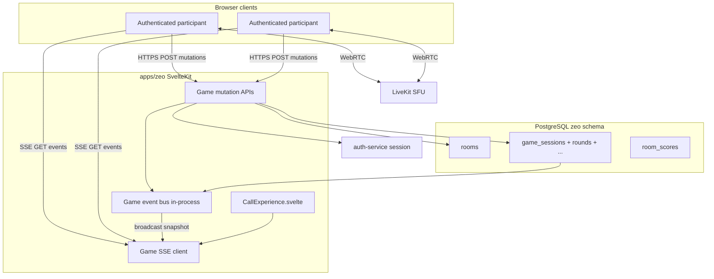
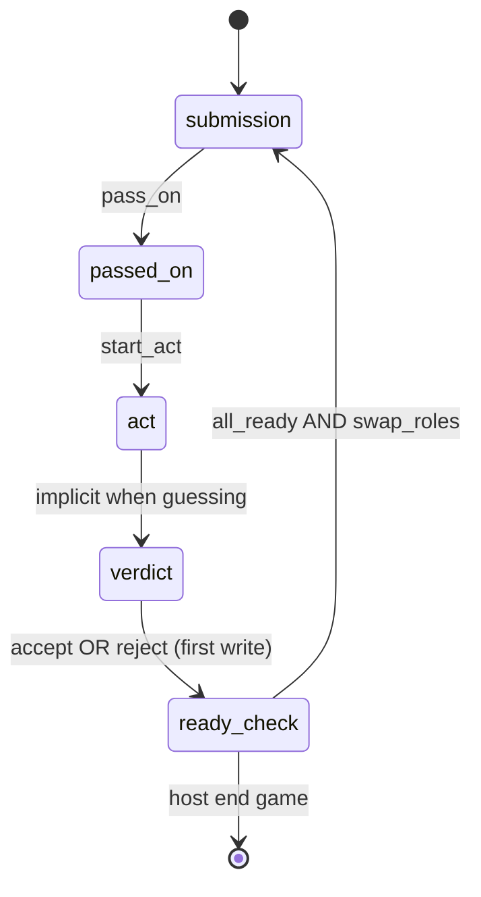

# zeo Game Mode — Architecture (Phase 4)

**Status:** final  
**Created:** 2026-07-12  
**Extends:** `architecture.md` (Phase 1–3 video calling)  
**Sources:** `prd-zeo-game-mode-2026-07-12/`, `ux-zeo-game-mode-2026-07-12/`

---

## 1. Overview

Phase 4 adds **server-authoritative in-call games** to zeo, starting with **Charades**, plus **removal of guest join**. Game state lives in PostgreSQL; clients sync via **SSE** (push) and **HTTP POST** (mutations). LiveKit remains the media plane only — game correctness does not depend on data channels.

Capacity, deployment, and media stack are unchanged: 2 rooms × 6 participants, KVM 2, Caddy + LiveKit + PostgreSQL 18.

---

## 2. System context (updated)



**Single-process assumption:** SSE broadcast uses an in-memory pub/sub keyed by `game_session_id`. Acceptable for single VPS zeo instance (current deployment). Multi-instance would require Redis pub/sub — out of scope until horizontal scaling.

---

## 3. Architectural principles

| Principle | Decision |
|-----------|----------|
| Source of truth | PostgreSQL rows + transactional mutations |
| Client role | Propose actions; render server snapshot; hide UI by role client-side |
| Media vs game | LiveKit for A/V only; game never on data channel for MVP |
| Sync transport | SSE down, HTTP POST up |
| Concurrency | `SELECT … FOR UPDATE` on round row; `UPDATE … WHERE phase = X` guards |
| Identity | Authenticated `user.id` only post G0 |
| Extensibility | `game_type` + `config` jsonb + pluggable layout/tile modules |

---

## 4. Guest removal (Epic G0)

### 4.1 Decision

Zeo **requires Better Auth session** for all room join and in-call APIs. Guest token mint, guest display name lobby, and `guest_*` LiveKit identities are removed from zeo.

Historical DB columns (`room_participants.is_guest`, `guest_display_name`) may remain for audit of old rows; new rows always have `is_guest = false` and `user_id` set.

### 4.2 Migration touchpoints

| Layer | Path | Change |
|-------|------|--------|
| API | `routes/api/rooms/[slug]/token/+server.ts` | `requireSession()`; reject 401 without session; remove `guestTokenSchema` branch |
| Validation | `lib/validation/rooms.ts` | Remove `guestTokenSchema`; simplify chat schema (no `guestIdentity`) |
| Server | `lib/server/identity.ts` | Remove `createGuestIdentity()` from zeo call paths |
| Server | `lib/server/rooms.ts` | `recordParticipantJoin` always sets `userId`, `isGuest: false` |
| UI | `PreCallLobby.svelte` | Remove guest name field; unauthenticated → redirect `/login?redirect=…` |
| UI | `CallExperience.svelte` | Remove `guestIdentity` / `guestName` state |
| UI | `ParticipantTile.svelte`, `VideoGrid.svelte` | Remove guest badge |
| UI | `ChatPanel.svelte` | Sender = session user only |
| API | `routes/api/rooms/[slug]/chat/+server.ts` | Require session |
| Waiting room | `HostWaitingPanel.svelte` | Copy update: "Admit participants" (still auth users in waiting room) |
| Session blocks | `room_session_blocks` | `participant_identity` = `user.id` only going forward |

### 4.3 Auth gate flow

```
GET /room/[slug]
  → load session
  → if !session → redirect /login?redirect=/room/[slug]
  → lobby (authenticated)
  → POST /api/rooms/[slug]/token (session required)
  → LiveKit identity = user.id
```

---

## 5. Domain model (new tables)

Add to `shared/db/src/schema/zeo.ts`:

### 5.1 Enums

```typescript
gameType          = "charades"  // extensible
gameSessionStatus = "setup" | "active" | "ended"
gameRoundPhase    = "submission" | "passed_on" | "act" | "verdict" | "ready_check" | "completed"
gameVerdict       = "accepted" | "rejected"
```

### 5.2 `game_sessions`

| Column | Type | Notes |
|--------|------|-------|
| id | uuid | PK, uuidv7() |
| room_id | uuid | FK → rooms; one **active** session per room |
| host_user_id | uuid | FK → auth.users |
| game_type | gameType | `charades` |
| status | gameSessionStatus | |
| team_count | int | 2–4; Charades = 2 |
| config | jsonb | `{ "charades": { "mimeIndexByTeam": { "teamId": 0 } } }` |
| created_at | timestamptz | |
| ended_at | timestamptz | nullable |

**Invariant:** at most one `status = 'active'` session per `room_id` (partial unique index or app guard + transaction).

### 5.3 `game_teams`

| Column | Type | Notes |
|--------|------|-------|
| id | uuid | PK |
| session_id | uuid | FK, cascade delete |
| name | text | "Team A" |
| color_key | text | maps to participant color palette |
| sort_order | int | 0..n-1 for layout |
| score | int | default 0; current game only |

### 5.4 `game_participants`

| Column | Type | Notes |
|--------|------|-------|
| session_id | uuid | FK |
| user_id | uuid | FK → auth.users |
| team_id | uuid | FK → game_teams, nullable between shuffle |
| is_ready | boolean | default false |
| PK | (session_id, user_id) | |

Populated from LiveKit-connected authenticated users at game start; reconciled on join/leave via webhook or in-call presence poll `[ASSUMPTION: snapshot built from DB participants + LiveKit webhook active set]`.

### 5.5 `game_rounds`

| Column | Type | Notes |
|--------|------|-------|
| id | uuid | PK |
| session_id | uuid | FK |
| round_number | int | 1-based |
| proposing_team_id | uuid | FK |
| guessing_team_id | uuid | FK |
| mime_user_id | uuid | FK → auth.users |
| phase | gameRoundPhase | |
| locked_word | text | nullable until pass-on |
| locked_suggestion_id | uuid | FK → game_suggestions, nullable |
| verdict | gameVerdict | nullable |
| resolved_by_user_id | uuid | nullable |
| created_at | timestamptz | |

Unique `(session_id, round_number)`.

### 5.6 `game_suggestions`

| Column | Type | Notes |
|--------|------|-------|
| id | uuid | PK |
| round_id | uuid | FK, cascade |
| suggester_user_id | uuid | |
| word | text | max 100 chars |
| created_at | timestamptz | |

### 5.7 `game_suggestion_votes`

| Column | Type | Notes |
|--------|------|-------|
| suggestion_id | uuid | FK |
| voter_user_id | uuid | |
| PK | (suggestion_id, voter_user_id) | multi-vote across different suggestions allowed |

Vote count = `COUNT(*)` per suggestion (no denormalized counter in MVP).

### 5.8 `room_scores`

| Column | Type | Notes |
|--------|------|-------|
| room_id | uuid | FK |
| user_id | uuid | FK |
| total_score | int | default 0 |
| games_played | int | default 0 |
| updated_at | timestamptz | |
| PK | (room_id, user_id) | persists for room lifetime |

On Charades accept: increment `game_teams.score` and add 1 to each guessing-team member's `room_scores.total_score` (upsert).

### 5.9 `game_chat_messages` (platform hook)

Deferred for Charades MVP schema migration if not needed immediately; define table for future games:

| Column | Type | Notes |
|--------|------|-------|
| id | uuid | |
| session_id | uuid | cascade delete |
| sender_user_id | uuid | |
| team_id | uuid | nullable = broadcast |
| body | text | |
| created_at | timestamptz | |

---

## 6. Game state machine

### 6.1 Session lifecycle

```
setup (teams assigned, no round)
  →[host start round 1]→ active
active
  →[host end game]→ ended
ended
  →[host start new game]→ new game_sessions row
```

### 6.2 Charades round phases



| Transition | Who | Guard |
|------------|-----|-------|
| `pass_on` | proposing team | ≥1 vote exists; phase = submission |
| `start_act` | any participant | phase = passed_on |
| `accept` / `reject` | proposing team | phase = verdict; first write wins |
| `ready` | each participant | phase = ready_check; idempotent |
| `all_ready` | server auto | all `game_participants.is_ready`; creates next round |
| `force_next` | host | any phase → next round or end; **no score** |
| `restart_round` | host | clear suggestions/votes; phase → submission; same teams/roles |
| `shuffle` | any `[per UX: panel button]` | only phase = ready_check |

### 6.3 Mime rotation

Stored in `game_sessions.config`:

```json
{
  "mimeRotation": {
    "<guessing_team_id>": 2
  }
}
```

Each new round: `mime_user_id = teamMembers[index % teamMembers.length]`; then increment index.

---

## 7. API design

Base: `/api/rooms/[slug]/game` — all routes require session + room membership (in call or registered participant).

### 7.1 Session management

| Endpoint | Method | Host | Purpose |
|----------|--------|------|---------|
| `/game` | POST | ✓ | Start game `{ gameType, teamCount }` |
| `/game` | DELETE | ✓ | End active game |
| `/game` | GET | | Current snapshot (HTTP fallback) |

### 7.2 Teams

| Endpoint | Method | Purpose |
|----------|--------|---------|
| `/game/shuffle` | POST | Reshuffle members (ready_check only) |
| `/game/teams/switch` | POST | `{ teamId }` — self switch (ready_check only) |

### 7.3 Round / Charades

| Endpoint | Method | Purpose |
|----------|--------|---------|
| `/game/rounds/suggest` | POST | `{ word }` |
| `/game/rounds/vote` | POST | `{ suggestionId }` — toggle vote |
| `/game/rounds/pass-on` | POST | Lock highest-voted suggestion |
| `/game/rounds/start-act` | POST | submission → act |
| `/game/rounds/verdict` | POST | `{ verdict: "accepted" \| "rejected" }` |
| `/game/rounds/ready` | POST | Mark self ready |
| `/game/rounds/force-next` | POST | Host only |
| `/game/rounds/restart` | POST | Host only |

### 7.4 SSE

| Endpoint | Method | Purpose |
|----------|--------|---------|
| `/game/events` | GET | `text/event-stream`; snapshot on connect + after each mutation |

**Event format:**

```
event: snapshot
data: {"version":42,"session":{...},"round":{...},"teams":[...],...}

event: ping
data: {}
```

- `version` monotonic per session (DB row `game_sessions.config.snapshotVersion` or separate counter).
- Heartbeat `ping` every 30s to keep proxies alive.
- On mutation: `commit` → `buildSnapshot(sessionId)` → `bus.publish(sessionId, snapshot)`.

### 7.5 Error contract

| Code | Meaning |
|------|---------|
| 401 | No session |
| 403 | Not host / wrong team / wrong phase actor |
| 409 | Stale phase / already judged / already ready |
| 422 | Validation (word too long, min players, shuffle impossible) |

Body: `{ "error": "already_judged", "snapshot": { ... } }` on 409 when useful for client reconcile.

---

## 8. Server module layout

```
apps/zeo/src/lib/server/game/
  index.ts              # re-exports
  authz.ts                # requireGameParticipant, requireHost, requirePhase
  snapshot.ts             # buildGameSnapshot(sessionId) → JSON
  event-bus.ts            # in-memory Map<sessionId, Set<WritableStreamDefaultWriter>>
  sse.ts                  # createSSEStream(sessionId)
  teams.ts                # autoSplit, shuffle, switchTeam
  sessions.ts             # startGame, endGame
  rounds/
    charades.ts           # phase transitions, mime pick, pass-on logic
    verdict.ts            # accept/reject transaction
  scores.ts               # award points, room_scores upsert

apps/zeo/src/routes/api/rooms/[slug]/game/
  +server.ts              # GET snapshot, POST start, DELETE end
  events/+server.ts       # SSE
  shuffle/+server.ts
  teams/switch/+server.ts
  rounds/
    suggest/+server.ts
    vote/+server.ts
    pass-on/+server.ts
    start-act/+server.ts
    verdict/+server.ts
    ready/+server.ts
    force-next/+server.ts
    restart/+server.ts
```

**Shared pattern for mutations:**

```typescript
async function mutateRound(roundId: string, fn: (tx) => Promise<void>) {
  await db.transaction(async (tx) => {
    const [round] = await tx.select().from(gameRounds)
      .where(eq(gameRounds.id, roundId))
      .for("update");
    await fn(tx, round);
  });
  const snapshot = await buildGameSnapshot(sessionId);
  gameEventBus.publish(sessionId, snapshot);
  return snapshot;
}
```

---

## 9. Client architecture

### 9.1 New / extended modules

```
apps/zeo/src/lib/
  stage-grid.ts              # StageLayoutMode += "game"
  call/
    game-layout.ts           # computeGameLayoutFrames(teams, viewport)
    game-state.ts            # SSE client, writable store, reconnect
    game-charades.ts         # visibility predicates (proposing team, mime)
  components/call/
    GamePanel.svelte
    GamePhaseBanner.svelte
    FloatingSuggestionTile.svelte
    MimeWordOverlay.svelte   # wraps ParticipantTile region
    GameScoreboard.svelte
    ControlBar.svelte        # + game button
    CallExperience.svelte    # wire SSE, game view, panel exclusivity
    VideoGrid.svelte         # branch game layout
```

### 9.2 SSE client (`game-state.ts`)

```typescript
// Pseudocode
export function connectGameSSE(slug: string, onSnapshot: (s: GameSnapshot) => void) {
  const es = new EventSource(`/api/rooms/${slug}/game/events`);
  es.addEventListener("snapshot", (e) => onSnapshot(JSON.parse(e.data)));
  es.onerror = () => { /* backoff reconnect; GET /game fallback */ };
  return () => es.close();
}
```

Store drives:
- `stageLayoutMode = "game"` when `session.status === "active"`
- Team columns via `game-layout.ts`
- Component visibility via `game-charades.ts` predicates

### 9.3 Game layout algorithm (`game-layout.ts`)

Input: `teams[]` with `memberUserIds`, `sortOrder`; viewport `width × height`; `controlBarReservePx`.

**2 teams:** split viewport 50/50 minus gutter; stack tiles vertically per column using existing `computeParticipantGrid` logic scoped to column width.

**3 teams:** top band 100% width, 3 equal columns.

**4 teams:** top band 75% height (3 cols); bottom band 25% (team 4 centered, max 50% width).

Output: `Map<tileKey, TilePosition>` same shape as auto-layout frames for `VideoGrid` reuse.

### 9.4 Visibility (client-side)

```typescript
export function showSuggestionTile(s: GameSnapshot, userId: string): boolean {
  return s.round?.phase === "submission"
    && s.teams.find(t => t.id === s.round.proposingTeamId)?.memberUserIds.includes(userId);
}

export function showMimeWord(s: GameSnapshot, userId: string): boolean {
  return s.round?.mimeUserId === userId
    && ["passed_on", "act"].includes(s.round.phase)
    && s.round.lockedWord != null;
}
```

Server includes `lockedWord` in snapshot for all clients (PRD decision).

### 9.5 Charades mutation helpers

Thin `fetch` wrappers returning `{ snapshot }` or throwing on 409 with snapshot for toast + reconcile.

---

## 10. Shuffle algorithm

```typescript
function shuffleTeams(participants: string[], teamCount: number): Map<teamId, string[]> {
  const shuffled = fisherYates([...participants]);
  const buckets = Array.from({ length: teamCount }, () => [] as string[]);
  shuffled.forEach((uid, i) => buckets[i % teamCount].push(uid));
  // rebalance: while any bucket.length < 2 && max bucket > 2, move one
  rebalanceMinTwo(buckets);
  if (buckets.some(b => b.length < 2)) throw unprocessable("Cannot shuffle with current player count");
  return buckets;
}
```

Only callable when `round.phase === "ready_check"`. Clears all `is_ready`.

---

## 11. Accept/Reject transaction

```sql
BEGIN;
  SELECT id, phase FROM game_rounds WHERE id = $1 FOR UPDATE;
  -- abort 409 if phase != 'verdict'

  UPDATE game_rounds
  SET phase = 'ready_check',
      verdict = $2,
      resolved_by_user_id = $3
  WHERE id = $1 AND phase = 'verdict'
  RETURNING id, guessing_team_id;

  -- if no row: ROLLBACK → 409 already_judged

  -- if verdict = 'accepted': increment game_teams.score; upsert room_scores for guessing team members
COMMIT;
```

---

## 12. Security

| Concern | Mitigation |
|---------|------------|
| Unauthenticated game API | Session middleware on `/game/*` |
| Cross-room access | Resolve `slug` → `room_id`; verify user in participants |
| Host-only actions | `room.host_user_id === session.user.id` |
| Phase gating | Server validates phase on every mutation |
| SSE hijacking | Same session cookie; room membership check on stream open |
| Suggestion leak | Client hide only (accepted risk); optional future server filter |
| Rate limit | Reuse token rate-limit pattern: 30 mutations/min/user |

---

## 13. Observability

Structured logs:
- `game.start`, `game.end`, `game.phase_transition`
- `game.verdict` with `{ roundId, verdict, resolvedBy }`
- `game.conflict` on 409
- `game.sse.connect`, `game.sse.disconnect`

Metrics (optional Phase 4.1): active game sessions, SSE connections, mutation latency p95.

---

## 14. Testing strategy

| Layer | Approach |
|-------|----------|
| Unit | shuffle algorithm, mime rotation, tie-break on suggestions |
| Integration | `Promise.all` concurrent verdict POSTs → one 200, one 409 |
| Integration | phase guards → 409 on wrong phase |
| E2E (manual) | 4+ browsers Charades happy path |

Tests run against PG18 `zeo` test schema; no SQLite.

**Critical AC tests:**
- Concurrent accept → single score increment
- Force next → no score change
- Restart → suggestions gone, team scores unchanged
- Guest token → 401

---

## 15. Phased technical delivery

| Epic | Deliverables |
|------|--------------|
| **G0** | Guest removal (API, lobby, UI, chat) |
| **G1** | Schema migration, `game_sessions`, SSE bus + endpoint, `game-state.ts`, game view shell |
| **G2** | Teams auto-split, shuffle, switch, `game-layout.ts` |
| **G3** | `room_scores`, scoreboard API fields in snapshot |
| **G4** | `FloatingSuggestionTile`, drag position |
| **G5** | Charades round loop, all mutation endpoints |
| **G6** | Host force-next, restart, end game |

**Build order:** G0 → G1 → G2 → G5 (backend) → G4 + G5 (UI) → G3 → G6.

---

## 16. Risks and mitigations

| Risk | Mitigation |
|------|------------|
| SSE dropped on mobile background | Reconnect + `GET /game` full snapshot; show "Syncing…" banner |
| Participant list desync vs LiveKit | Build game participant set at start; optional webhook refresh on join/leave |
| Single-instance event bus | Document; Redis if second zeo instance added |
| CPU with game UI + 6 video tiles | No extra animations; game view uses same tile components |
| Guest removal breaks shared docs | Update AGENTS.md, README, original PRD supersession table |

---

## 17. Resolved decisions (Phase 4)

1. **Sync:** SSE + HTTP POST (not polling, not LiveKit data channel for state).
2. **Guest join:** removed from zeo.
3. **Suggestion visibility:** client-side hide; full snapshot from server.
4. **Accept/Reject:** first server write wins via `FOR UPDATE`.
5. **Force next:** no score; **restart:** clear suggestions/votes only.
6. **Mime rotation:** within guessing team, index in `game_sessions.config`.
7. **Shuffle:** button action in `ready_check` only.
8. **Layout:** extend `StageLayoutMode` with `"game"`; dedicated `game-layout.ts`.

---

## 18. Open technical questions

| # | Question | Default |
|---|----------|---------|
| OT-1 | Host disconnect mid-game | Pause UI; no auto-promote in MVP |
| OT-2 | Player joins mid-game | Show in scoreboard but not in `game_participants` until next game `[ASSUMPTION]` |
| OT-3 | `game_chat_messages` in G1 schema or defer | Defer until second game needs it |

---

## 19. References

- PRD: `_bmad-output/zeo/planning-artifacts/prds/prd-zeo-game-mode-2026-07-12/prd.md`
- UX: `_bmad-output/zeo/planning-artifacts/ux-designs/ux-zeo-game-mode-2026-07-12/`
- Base architecture: `_bmad-output/zeo/planning-artifacts/architecture.md`
- Code extension points: `CallExperience.svelte`, `stage-grid.ts`, `shared/db/src/schema/zeo.ts`
