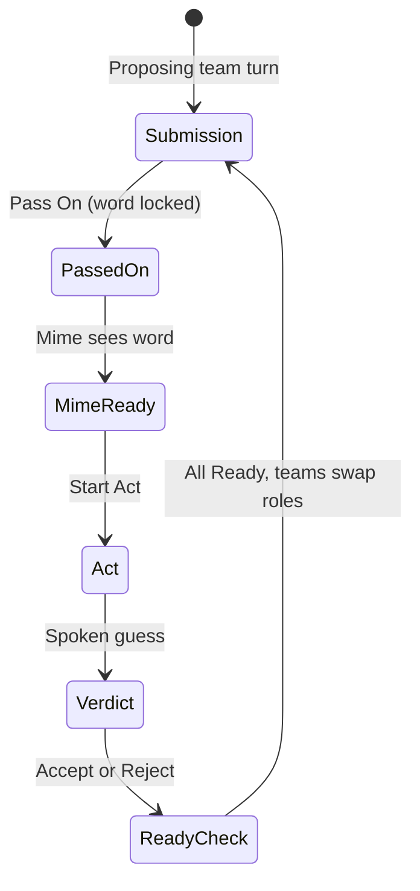

# Zeo Game Mode — Charades MVP (Planning Decisions)

**Status:** Draft — decisions locked from Party Mode + user confirmation  
**Date:** 2026-07-12  
**Scope:** Game mode platform + Charades as first game; guest mode removal from Zeo

---

## 1. Locked decisions

| Topic | Decision |
|-------|----------|
| Game authority | Server maintains all game state; clients propose via HTTP POST |
| Real-time sync | **SSE** (state snapshots) + HTTP POST (mutations). Not 2.5s polling for game state |
| Accept/Reject | Proposing team, any member; **first server write wins** (`SELECT FOR UPDATE` + status guard) |
| Suggestion tile visibility | **Client-side only** — proposing team sees floating tile; acceptable for play, not security-sensitive |
| Force next round | **No score** awarded for that round; advance to next round |
| Restart round | Wipes suggestions + votes for current round; **does not undo** points already scored in prior rounds |
| Guest mode | **Disable guest join in Zeo entirely** — logged-in users only for all calls and games |
| Mime rotation | Rotates **within the guessing team** each round (not cross-team global rotation) |
| Shuffle | **Button** (not toggle); press re-shuffles team member assignments |
| Team switch | Players may switch teams **between rounds only** |
| Min team size | 2 members per team; uneven splits allowed |
| Timers | Out of MVP (TODO later) |
| Game chat | Ephemeral; deleted when game ends. Charades uses suggestion tile instead of team chat |
| Opponent sub-team chat | Not required for Charades |
| Charades game tile | None — faces are the stage |
| Room scoreboard | Persists individual scores across games within a room session |
| Host controls | Start/end/switch game; force next round; restart round; decides when to stop |

---

## 2. Platform requirements (all games)

### 2.1 Entry & lifecycle

- **FR-GM-1:** Control bar exposes a Game Mode button (host only for start/configure).
- **FR-GM-2:** Game settings panel opens from control bar (bottom-left, mutual exclusion with grid settings / devices panels).
- **FR-GM-3:** Host selects game type, team count (max 4), and starts game.
- **FR-GM-4:** Only host may end current game or switch to another game.
- **FR-GM-5:** When game is active, **all participants** use **game view** (third layout mode alongside auto/grid).
- **FR-GM-6:** Game view supports optional centered game tile (game-dependent); Charades has none.

### 2.2 Teams & layout

- **FR-GM-7:** On game start, auto-split logged-in participants into teams.
- **FR-GM-8:** Shuffle button re-assigns members across teams (must respect min 2 per team when possible).
- **FR-GM-9:** Players may switch teams between rounds via game panel.
- **FR-GM-10:** Team layouts:
  - 2 teams: left / right columns
  - 3 teams: all on top row
  - 4 teams: teams 1–3 top, team 4 bottom
- **FR-GM-11:** Player video tiles rearrange by team assignment in game view.

### 2.3 Scoring

- **FR-GM-12:** Team point awards apply to all members of that team for the current game.
- **FR-GM-13:** Each game maintains its own team scores during play.
- **FR-GM-14:** Room maintains a **persistent individual scoreboard** aggregating points across all games in the room.
- **FR-GM-15:** Force next round → no points for that round. Restart round → clear round suggestions/votes only.

### 2.4 Chat (future games)

- **FR-GM-16:** Game-scoped messages are ephemeral (deleted when game ends).
- **FR-GM-17:** Team-internal chat channel (when game defines it).
- **FR-GM-18:** Opponent sub-team messaging (when game defines it) — not Charades.

### 2.5 Specialized tiles

- **FR-GM-19:** Games may define floating and/or docked UI tiles.
- **FR-GM-20:** Floating tiles are draggable, render above video tiles.

### 2.6 Auth

- **FR-GM-21:** All game participation requires authenticated session.
- **FR-GM-22:** **Guest join disabled for Zeo** — remove guest token flow, guest UI, and guest-specific call paths.

---

## 3. Charades MVP requirements

### 3.1 Setup

- **FR-CH-1:** Exactly 2 teams.
- **FR-CH-2:** Teams alternate proposing/guessing roles each round.
- **FR-CH-3:** Minimum 4 logged-in players to start (2 per team).

### 3.2 Round flow

#### Phase 1 — Submission

- **FR-CH-4:** Proposing team sees floating suggestion tile (client-side visibility).
- **FR-CH-5:** Tile shows all suggestions with vote counts; highest voted highlighted.
- **FR-CH-6:** Members submit word suggestions via input at bottom of tile.
- **FR-CH-7:** One person may vote on **multiple** suggestions; votes may be changed.
- **FR-CH-8:** When at least one voted suggestion exists, **Pass On** appears; any proposing-team member may press it → word locked.
- **FR-CH-9:** Mime (from guessing team, rotated within team) sees locked word.
- **FR-CH-10:** No think-time limit in MVP.
- **FR-CH-11:** Any member from either team may press **Start Act**.

#### Phase 2 — Act

- **FR-CH-12:** Mime acts; guessing team guesses **spoken aloud** (no typed guess UI).
- **FR-CH-13:** Proposing team sees Accept / Reject; any member may click; server resolves first write.
- **FR-CH-14:** Accept → 1 point to guessing team (all members).
- **FR-CH-15:** Reject → no point.

#### Between rounds

- **FR-CH-16:** All players mark **Ready**; when all ready → next round with teams swapping proposing/guessing roles.
- **FR-CH-17:** Mime pointer advances within guessing team each round.

### 3.3 Host controls (Charades)

- **FR-CH-18:** Host may force next round (no score for current round).
- **FR-CH-19:** Host may restart round (clear suggestions/votes).
- **FR-CH-20:** Host decides when to end game (no fixed win condition in MVP).

---

## 4. Technical direction (from Party Mode)

| Layer | Choice |
|-------|--------|
| State store | PostgreSQL (`zeo` schema) — `game_sessions`, `game_teams`, `game_participants`, `game_rounds`, `game_suggestions`, `game_suggestion_votes`, `room_scores` |
| Push | SSE `GET /api/rooms/[slug]/game/events` |
| Mutations | HTTP POST under `/api/rooms/[slug]/game/*` |
| Concurrency | `SELECT FOR UPDATE` transactions; 409 on stale writes |
| Client orchestration | `CallExperience.svelte` — SSE subscription, `stageLayoutMode: "game"` |
| Suggestion visibility | Server sends full state; client hides tile from non-proposing team |

---

## 5. Guest mode removal (cross-cutting)

Removing guest mode affects Zeo beyond game mode:

- `POST /api/rooms/[slug]/token` — reject unauthenticated requests
- `PreCallLobby.svelte` — remove guest name entry path
- `CallExperience.svelte` / identity — drop `guestIdentity` branches where Zeo-specific
- `ChatPanel`, `ParticipantTile` — remove guest badge paths
- `room_waiting_entries` / waiting room — guests N/A if login required
- PRD addendum + architecture update required

---

## 6. Open items (minor)

| Item | Default proposal |
|------|------------------|
| When is Shuffle available? | Lobby + between rounds (not mid-round) |
| Shuffle with min-2 constraint | Algorithm: shuffle all members, re-split; if any team &lt; 2, redistribute from largest team |
| Host leaves mid-game | Pause with "waiting for host" or auto-promote — **TBD** |
| Late joiner during active game | Show brief context overlay — **TBD** |

---

## 7. Suggested epics (preview)

| Epic | Goal |
|------|------|
| **G0** | Remove guest mode from Zeo |
| **G1** | Game mode shell (button, panel, game view layout, SSE infra) |
| **G2** | Teams engine (auto-split, shuffle button, switch between rounds, layouts) |
| **G3** | Scoring + room scoreboard |
| **G4** | Floating tile framework |
| **G5** | Charades full round loop |
| **G6** | Host controls (force next, restart, end) |

---

## 8. Next BMad steps

1. **[PRD] `bmad-prd` Update** — fold FRs into PRD addendum  
2. **[CU] `bmad-ux`** — game panel, charades phases, floating tile  
3. **[CA] `bmad-create-architecture` Update** — SSE, schema, guest removal  
4. **[CE] `bmad-create-epics-and-stories`** — G0–G6 stories  
5. **[IR] `bmad-check-implementation-readiness`**
