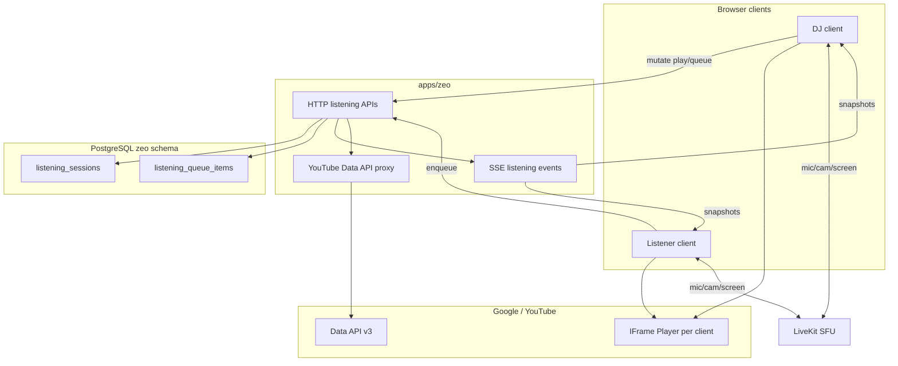

# Zeo Shared Listening — Planning Decisions

**Status:** Draft — proposed locks pending user confirmation  
**Date:** 2026-07-25  
**Scope:** In-call shared listening tile + queue for YouTube / YouTube Music content  
**Extends:** zeo video calling (LiveKit) + game-mode sync pattern (SSE + HTTP)

---

## 0. Hard constraint (read first)

| Expectation | Reality |
|-------------|---------|
| “I have YouTube Music Premium → zeo can drive YT Music like Spotify Connect” | **False.** YouTube Music has **no public Web Playback / Embed SDK** for third-party apps. Premium does not unlock one. Community requests for Spotify-parity APIs remain open and unmet. |
| “Screen-share YT Music tab → zeo reads title/art/seek/queue” | **False.** `getDisplayMedia` yields pixels + audio only. No Media Session bridge from other tabs. |
| “Stream YT Music audio through LiveKit / extract audio from videos” | **Violates YouTube API ToS** (no separating audio; must preserve standard player experience). |

**What Premium *does* help with (in-browser):** if a participant is signed into Google with YouTube/YT Music Premium in that browser profile, **their** YouTube iframe playback may be ad-light / background-eligible per Google’s product rules. zeo cannot assume every participant has Premium; sync and UX must tolerate ads and autoplay gates.

**Viable official path:** **YouTube IFrame Player API** (+ optional **YouTube Data API v3** for search/metadata). Most YouTube Music catalog tracks map to a playable **YouTube `videoId`**. Product copy should say **“YouTube”** (or “YouTube / Music links”), not claim native YouTube Music app control.

**Rejected for zeo:** InnerTube / ytmusicapi / yt-dlp / unofficial stream URLs into the SFU. Fragile, ToS-hostile, ops burden, Premium cookies become a credential risk.

---

## 1. Proposed locked decisions

| Topic | Decision |
|-------|----------|
| Product name | **Shared Listening** (in-call mode), not “screen share music” |
| Catalog / playback | **YouTube IFrame Player API** only for MVP |
| YouTube Music | Treat as **URL / search input** that resolves to a YouTube `videoId` (watch URL, `music.youtube.com` URL when mappable, or Data API search). No native YTM player. |
| Audio transport | **Each client plays locally** in an embedded YouTube player. Music audio does **not** go through LiveKit. LiveKit stays mic/cam/screen. |
| Sync authority | **Server-authoritative session state** (same pattern as game mode): Postgres + HTTP mutations + **SSE** snapshots. Not LiveKit data channels for MVP. |
| DJ role | Room **host is DJ** by default. Host can hand off DJ to another participant. Only DJ: play/pause, seek, skip, clear queue reorder (policy below). |
| Queue adds | **Any authenticated participant** may enqueue. DJ may remove/reorder. |
| Stage UI | New stage tile kind: **`listening`** — Now Playing (art/title, seek, transport). Queue lives in a side panel (not first-viewport clutter on the tile). |
| Video visibility (ToS) | Player must remain a **real YouTube experience**: title + thumbnail/video visible. Default tile shows art + chrome; **expand / “Show video”** reveals the iframe at meaningful size. Do **not** ship a hidden 0×0 iframe “audio only” product. |
| Coexistence | Listening may run **with** mic/cam. If screen share starts, listening **keeps playing** unless DJ pauses; layout: screen-share remains dominant primary; listening tile stays in sidebar/rail. |
| Mutual exclusion | At most **one** listening session per room. Starting listening does not stop screen share (and vice versa). |
| Capacity | Unchanged: ≤2 rooms, ≤6 participants. |
| Auth | Authenticated users only (post guest removal). |
| Out of MVP | Spotify, Apple Music, official YTM SDK (doesn’t exist), lyrics, collaborative playlist import from YTM library OAuth, cross-room persistence of queues. |

---

## 2. User journeys (MVP)

### UJ-1 — Host starts a listen session
Host opens **Listen** from the control bar → session created → empty Now Playing tile appears → host pastes a YouTube or YouTube Music link (or searches) → track loads for everyone → host hits play (or autoplay after gesture).

### UJ-2 — Friend queues the next song
Any participant opens Queue → search or paste link → item appears at end → when current track ends, server advances queue → all clients load next `videoId` and play from 0 (within sync tolerance).

### UJ-3 — Late joiner
Participant joins mid-track → receives SSE snapshot `{videoId, positionMs, paused, queue, djUserId, serverTime}` → local player seeks and matches play/pause within ~0.5–1.5s.

### UJ-4 — Hand off DJ
Host transfers DJ → new DJ gets transport controls; previous DJ becomes queue-contributor only.

### UJ-5 — End listening
DJ or host ends session → tile + queue tear down; YouTube players destroy; mic/cam unaffected.

---

## 3. Functional requirements (draft)

### 3.1 Session lifecycle
- **FR-SL-1:** Control bar exposes **Listen** (available to host to start; visible state to all when active).
- **FR-SL-2:** Host starts/ends the listening session.
- **FR-SL-3:** Session state survives participant leave/rejoin until ended or room ends.
- **FR-SL-4:** Room end / LiveKit room finish clears listening session.

### 3.2 Playback & sync
- **FR-SL-5:** DJ can play, pause, seek, previous, next.
- **FR-SL-6:** Server stores canonical `videoId`, `positionMs` (or `startedAt` + `pausedAt` clock model), `playbackState`.
- **FR-SL-7:** Clients resync on SSE snapshot and periodically (drift correction via `seekTo` / rate nudge within thresholds).
- **FR-SL-8:** On track `ENDED`, server advances to next queue item (or stops if empty).
- **FR-SL-9:** Autoplay: first play in a browser session may require a user gesture; UI shows “Tap to join audio” for listeners blocked by autoplay policy.

### 3.3 Queue
- **FR-SL-10:** Queue is an ordered list of `{videoId, title, channelTitle, thumbnailUrl, addedByUserId, durationHint?}`.
- **FR-SL-11:** Any participant can add via paste URL or search.
- **FR-SL-12:** DJ can remove any item, reorder, and skip current.
- **FR-SL-13:** Duplicate `videoId` policy: **allow** duplicates (karaoke / replay friendly) unless we later add a toggle.
- **FR-SL-14:** Soft cap: e.g. **50** queued items; reject with clear error when full.

### 3.4 Discovery
- **FR-SL-15:** Accept `youtube.com/watch`, `youtu.be/`, `youtube.com/shorts/`, and `music.youtube.com/watch` URLs; resolve to `videoId`.
- **FR-SL-16:** Search uses YouTube Data API v3 (`search.list` + `videos.list` for metadata). API key is **server-side only**.
- **FR-SL-17:** If a YTM URL cannot be mapped to an embeddable `videoId`, show a clear error (“This Music link isn’t playable in zeo — try the YouTube video link or search”).

### 3.5 Tile & panel UX
- **FR-SL-18:** `listening` stage tile shows: artwork, title, artist/channel, scrubber, play/pause, prev/next (DJ only for transport; listeners see read-only scrubber or local-only seek that re-snaps — **prefer DJ-only seek** for sync sanity).
- **FR-SL-19:** Listeners get **local volume** for the YouTube player (independent of LiveKit tile volumes).
- **FR-SL-20:** Queue panel lists upcoming tracks, add form, and who added what.
- **FR-SL-21:** “Show video” expands iframe to a compliant visible player (modal or enlarged tile region).

### 3.6 Roles
- **FR-SL-22:** `djUserId` defaults to room host on session start.
- **FR-SL-23:** Host may transfer DJ; optional: host always retains end-session power.

---

## 4. Architecture sketch

### 4.1 Why not pipe music through LiveKit?
- YouTube ToS: don’t separate/restream audio.
- Quality: YouTube CDN Opus/AAC > double-encoded WebRTC music.
- Bandwidth: SFU already carries 6-person A/V; keep music off it.
- Ads / Premium / region: each user’s Google session remains theirs.

### 4.2 Clock model (recommended)
Store either:
- **Playing:** `anchorServerTime` + `anchorPositionMs` (position at that server time), or
- **Paused:** `pausedPositionMs`

Clients compute `expectedPosition = anchorPosition + (now - anchorServerTime)` with server–client offset estimated from SSE event timestamps. Reseek if `|drift| > 1.0s`; ignore if `< 0.35s`.

### 4.3 Schema (sketch)
- `listening_sessions`: `id`, `room_id` unique active, `dj_user_id`, `video_id` nullable, `playback_state`, `anchor_server_time`, `anchor_position_ms`, `created_at`, `ended_at`
- `listening_queue_items`: `id`, `session_id`, `position` int, `video_id`, `title`, `channel_title`, `thumbnail_url`, `added_by_user_id`, `created_at`

### 4.4 API surface (sketch)
- `POST /api/rooms/[slug]/listening` — start
- `DELETE …/listening` — end
- `GET …/listening/events` — SSE
- `POST …/listening/play|pause|seek|skip|previous`
- `POST …/listening/queue` — add
- `PATCH …/listening/queue` — reorder / remove
- `POST …/listening/dj` — transfer
- `GET …/listening/search?q=` — Data API proxy

Mirror game-mode authz: room membership required; DJ checks on transport routes.

### 4.5 Client modules (zeo)
- `lib/listening/` — session store, SSE client, clock sync
- `lib/youtube/iframe-player.ts` — load YT API script, player wrapper
- `components/call/ListeningTile.svelte` — Now Playing chrome
- `components/call/ListeningQueuePanel.svelte`
- Extend `StageTileEntry` with `kind: "listening"`
- Control bar Listen control next to Share / Game

---

## 5. YouTube compliance checklist (non-negotiable)

| Rule | zeo response |
|------|----------------|
| Don’t offer audio-only / stripped player | Visible art + title; expandable real iframe |
| Don’t alter metadata deceptively | Show YouTube title/channel from API / player |
| Don’t download or isolate audio | IFrame only; no yt-dlp |
| Independent value | Sync + queue + call co-presence — not a YouTube clone |
| API key hygiene | Server-only Data API key; quota monitoring |
| Referer / client identity | Serve embeds from zeo origin with proper Referer (error 153 awareness) |

---

## 6. Phasing

### Phase 1 — MVP (ship)
- Session start/end, DJ = host
- Paste YouTube / YTM-watch URL → play
- Now Playing tile + transport + seek
- Queue add/list/skip; auto-advance
- SSE sync + autoplay gate UI
- Show video expand

### Phase 2 — Discovery polish
- In-panel search (Data API)
- DJ handoff
- Queue reorder drag
- Better drift telemetry / “sync” indicator

### Phase 3 — Nice-to-haves (only if still needed)
- Playlist URL expand (`list=` → enqueue N items, capped)
- Persist “recent room listens” for host
- Revisit providers **only if** Google ships a real Music playback SDK

### Explicit non-goals
- Controlling the standalone YouTube Music PWA/app
- Screen-share metadata detection
- Karaoke pitch / stem separation
- Server-side audio mixing into the call

---

## 7. Risks

| Risk | Mitigation |
|------|------------|
| Embed blocked / error 150/101 for some Music tracks | Clear error; suggest Search on YouTube; skip to next |
| Sync drift / ads differ per user | DJ-authoritative clock; listeners may briefly desync during ads; show “waiting for DJ” if needed |
| Autoplay policies | Explicit “Tap to listen” CTA; keep player muted until gesture then unmute (pattern must still keep video available) |
| Data API quota | Cache video metadata by `videoId`; rate-limit search; soft queue cap |
| Users expect true YTM library / Radio / Mixes | Product messaging: “Play YouTube tracks together,” not full YTM feature parity |
| ToS audit | Keep iframe visible path; avoid hidden-audio UX; document in architecture |

---

## 8. Open questions for confirmation

1. **DJ policy:** Host-only DJ for MVP, or host + handoff in Phase 1?
2. **Listener seek:** DJ-only scrubber (recommended), or allow listeners to seek locally (breaks shared sync)?
3. **Default tile mode:** Art-forward with expand-to-video (recommended) vs always-show small iframe?
4. **Game mode interaction:** Pause listening when a game starts, or allow both?
5. **Search in MVP** or paste-URL-only for Phase 1?

---

## 9. Recommended next BMad steps

After decisions in §1 and §8 are confirmed:

1. **[PRD]** `bmad-prd` — feature PRD under `_bmad-output/zeo/planning-artifacts/prds/prd-zeo-shared-listening-YYYY-MM-DD/` (same shape as game mode).
2. **[CU]** `bmad-ux` — Listen tile + queue panel in existing zeo stage language.
3. **[CA]** `bmad-create-architecture` — SSE/schema/API companion to `architecture-game-mode.md`.
4. **[CE]** Epics/stories → sprint.

Alternatively, if you want a thinner build contract first: **[SPEC]** `bmad-spec` with slug `shared-listening` (like `spec-stream-media-controls`).
