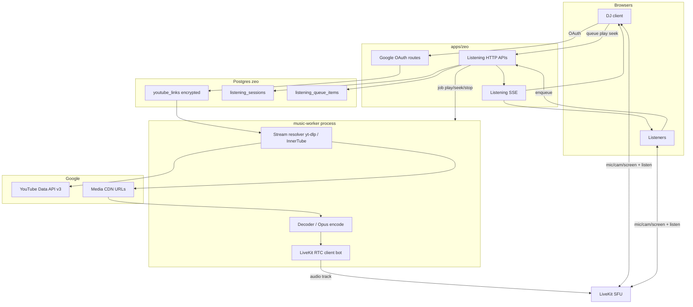

# Zeo Shared Listening — Planning Decisions (Discord-bot model)

**Status:** Draft — path locked by user 2026-07-25; open questions in §8  
**Date:** 2026-07-25  
**Scope:** In-call shared listening: one linked YouTube account, server-side stream extract + LiveKit relay, zeo-owned queue/controls  
**Extends:** zeo LiveKit rooms + game-mode sync pattern (SSE + HTTP)

---

## 0. Path lock

**Chosen model:** Discord music bot style — not IFrame sync, not headless Chrome UI automation.

| Piece | Choice |
|-------|--------|
| Identity | **One participant** (DJ) links their Google / YouTube account to the room session |
| Library | Fetch that account’s playlists / liked / searchable catalog |
| Playback | Server resolves a media URL (InnerTube / yt-dlp-class stack) → decode → **publish one audio track into LiveKit** |
| Experience | Everyone hears the **same** LiveKit stream (perfect sync, no per-user ads in the call) |
| Controls | Queue, play/pause, seek, skip, prev live in **zeo UI** (server-authoritative) |

### Honest risk (accepted)

This **violates YouTube API / ToS** (stream extraction + redistribution). Same gray area as public Discord music bots. Expect:

- Periodic **403 / cipher / bot-check** breakage
- Possible Google account friction for the linked DJ
- No official support; maintenance is ongoing (tokens, client rotation, yt-dlp updates)

Product is **personal / friend-group** (≤2 rooms × 6). Still document the risk; do not market as “official YouTube integration.”

### Rejected alternatives (for this plan)

| Alternative | Why not (now) |
|-------------|----------------|
| Per-client YouTube IFrame + SSE sync | Ads/desync; no single source; weak library story |
| Headless Chrome capture of ytm.web | Heavier on KVM 2; still ToS-hostile; CAPTCHA hell |
| Official YTM Web Playback SDK | Does not exist |

---

## 1. Locked product decisions

| Topic | Decision |
|-------|----------|
| Product name | **Shared Listening** |
| Account link | DJ (default: room host) completes **Google OAuth** once; tokens stored encrypted server-side, scoped to that user |
| Who’s “signed in” for playback | **DJ’s linked Google account** used by the music worker for resolve + (where needed) age-gated content. Listeners do **not** sign into Google for music. |
| Ads in the call | **None from YouTube** in the LiveKit path (audio is extracted/relayed). Creator-read ads inside the original video are irrelevant; listeners never see the YT player. |
| Transport | Music audio = **LiveKit track** from a server **listening-bot** participant. Mic/cam/screen unchanged. |
| Sync | Trivial: one SFU audio track. Position/seek are bot-side, broadcast as metadata via SSE. |
| Queue / transport UI | Zeo Now Playing tile + queue panel; server authoritative (Postgres + HTTP + SSE), same pattern as game mode. |
| DJ role | Host is DJ on session start; host may hand off DJ (requires new DJ to have linked Google **or** session keeps using original linker’s tokens — see §8). |
| Queue adds | Any room participant may enqueue (search, paste URL, pick from DJ library browser). |
| Stage tile | `kind: "listening"` — art, title, scrubber, transport (DJ), local listen volume (already exists for remote audio tiles). |
| Video | **Audio-only relay for MVP** (Discord-like). Optional later: low-res video track or thumbnail-only chrome. |
| Capacity | ≤2 concurrent listen sessions (= room cap). One bot per active listening room. |
| Coexistence | Listening + mic/cam OK. Screen share OK; layout keeps share dominant, listening tile in rail. |

---

## 2. User journeys

### UJ-1 — Link & start
Host opens **Listen** → if no Google link, OAuth connect (“Connect YouTube”) → session starts → listening-bot joins LiveKit room → empty Now Playing tile.

### UJ-2 — Play from library
DJ opens Library → sees playlists / Liked → picks a playlist → picks a track (or “Play playlist”) → worker resolves stream → bot publishes audio → tile shows metadata + seek.

### UJ-3 — Search & queue
Anyone searches (“lofi girl”, paste `youtu.be/…` or Music URL) → results → **Add to queue**. On track end, server advances; worker loads next.

### UJ-4 — Controls
DJ: play/pause, seek, skip, previous, reorder/remove queue. Listeners: local volume / listen-mute on the listening tile (existing LiveKit `setVolume` pattern).

### UJ-5 — Late join
Joiner already subscribed to bot track via LiveKit; SSE fills queue + now-playing chrome. No catch-up download.

### UJ-6 — End / unlink
Host ends listening → bot leaves, worker stops, queue cleared. Unlinking Google revokes refresh token and disables library until reconnected.

---

## 3. Functional requirements (draft)

### 3.1 Account linking
- **FR-SL-1:** User can connect Google with YouTube scopes (`youtube.readonly` minimum; widen only if needed).
- **FR-SL-2:** Refresh tokens stored encrypted at rest; decrypt only on worker/API use.
- **FR-SL-3:** User can disconnect; tokens deleted; active session using that link ends or falls back (policy in §8).
- **FR-SL-4:** Only the **session linker** (or current DJ policy) credentials are used for resolve for that room’s listen session.

### 3.2 Library & search
- **FR-SL-5:** List DJ’s YouTube playlists (`playlists.list?mine=true`).
- **FR-SL-6:** List playlist items; Liked via `playlistId=LL` / `videos.list?myRating=like`.
- **FR-SL-7:** Search videos (Data API `search.list` and/or InnerTube `ytsearch` / `ytmsearch` via worker).
- **FR-SL-8:** Accept watch / youtu.be / shorts / music.youtube.com watch URLs → `videoId`.
- **FR-SL-9:** YouTube Music **library** (songs/albums not exposed as normal YT playlists): Phase 1b via InnerTube using linked account cookies/OAuth — if unstable, ship YT playlists + search first and label Music library as best-effort.

### 3.3 Playback worker
- **FR-SL-10:** On play/skip, worker resolves `videoId` → audio media URL using DJ credentials where required.
- **FR-SL-11:** Worker decodes to PCM/Opus and publishes to LiveKit as bot identity `listening-bot:{roomId}` (or similar).
- **FR-SL-12:** Pause = stop sending / gate audio; seek = restart decode from offset (or format-dependent seek).
- **FR-SL-13:** On natural end → notify app → advance queue → play next.
- **FR-SL-14:** Resolve failures → SSE error on tile (“Can’t play this track”) → optional auto-skip after N seconds.

### 3.4 Queue & session
- **FR-SL-15:** Server owns queue order, now-playing, `playbackState`, `positionMs` (updated by worker heartbeats).
- **FR-SL-16:** Soft cap **50** queue items.
- **FR-SL-17:** Duplicates allowed.
- **FR-SL-18:** One listening session per room.

### 3.5 UI
- **FR-SL-19:** Control bar **Listen** start/stop (host).
- **FR-SL-20:** Listening tile + queue/library panel.
- **FR-SL-21:** Show source badge (Library / Search / URL) and who enqueued.

---

## 4. Architecture



### 4.1 Process topology (KVM 2)

| Process | Role |
|---------|------|
| `apps/zeo` | Auth, OAuth, queue APIs, SSE, mint LiveKit tokens for humans + bot |
| `music-worker` | Long-lived Bun/Node or Python service; one active job per listening room (max 2) |
| LiveKit | Existing SFU; bot joins as hidden participant (UI filters `listening-bot:*` from camera grid; shows as listening tile source) |

Prefer **separate worker** over doing yt-dlp inside the SvelteKit request path (CPU, timeouts, crash isolation).

### 4.2 Resolve stack (Discord-equivalent)

Phase 1 target:

1. **yt-dlp** (or `youtube-source`-style InnerTube client) with DJ OAuth/cookie jar  
2. Prefer **bestaudio** / Opus-ish formats  
3. Pipe to ffmpeg → raw PCM or Opus  
4. Feed **LiveKit** via `@livekit/rtc-node` `AudioSource` / Python `rtc.AudioSource`, **or** WHIP ingress if RTC client proves painful

Operational knobs Discord bots use (plan to support as needed):

- Client rotation (WEB, ANDROID_MUSIC, TV+OAuth, …)
- PO token / remote cipher when signatures break
- Cookie refresh from stored Google refresh token

### 4.3 Library stack

| Data | Mechanism |
|------|-----------|
| Playlists, playlist items, likes, public search | **YouTube Data API v3** + DJ OAuth (supported, quota-bound) |
| YTM-only library / `ytmsearch` | **InnerTube** with same account (unofficial; Phase 1b) |

Cache playlist pages and video metadata in Redis or Postgres TTL to spare quota.

### 4.4 Schema sketch

```
youtube_account_links
  user_id PK/FK
  google_sub
  refresh_token_enc
  access_token_enc nullable
  access_expires_at
  scopes
  linked_at / revoked_at

listening_sessions
  id, room_id UNIQUE active
  linker_user_id          -- whose Google tokens the worker uses
  dj_user_id              -- who may transport-control
  playback_state          -- playing|paused|idle|error
  current_queue_item_id
  position_ms
  error_message
  bot_identity
  created_at, ended_at

listening_queue_items
  id, session_id, position
  video_id, title, channel_title, thumbnail_url, duration_ms
  source                  -- library|search|url
  added_by_user_id
```

### 4.5 API sketch

- `GET/DELETE /api/me/youtube-link` — link status / unlink  
- `GET /api/auth/youtube/start` + callback — OAuth  
- `POST /api/rooms/[slug]/listening` — start (requires linker)  
- `DELETE …/listening` — end  
- `GET …/listening/events` — SSE snapshots + errors  
- `GET …/listening/library/playlists`  
- `GET …/listening/library/playlists/[id]/items`  
- `GET …/listening/search?q=`  
- `POST …/listening/queue` · `PATCH` reorder/remove  
- `POST …/listening/play|pause|seek|skip|previous`  
- `POST …/listening/dj` — transfer controls  

Worker ↔ app: internal queue (Redis/Postgres `LISTEN`/`NOTIFY` or HTTP + lease) with job `{sessionId, action, videoId?, positionMs?}`.

### 4.6 Client UI hooks

- Filter bot identity out of participant tiles; bind listening tile audio to bot’s audio publication (or treat as dedicated stage tile fed by that track).
- Reuse per-tile listen volume for the listening tile.
- Library + queue in a bottom/side panel (same exclusion rules as devices / game settings).

---

## 5. Security

| Concern | Mitigation |
|---------|------------|
| Refresh token theft | Encrypt at rest (app secret / KMS-style key in env); never send to clients; audit log link/unlink |
| Scope creep | Request least privilege; document what zeo can read |
| Bot token mint | Server-only LiveKit token for `listening-bot:*`; not exposable to browsers |
| Abuse | Only room members; rate-limit search; room caps already small |
| Credential use | Tokens used only while an active listening session exists for rooms that user linked (or explicit “allow this room”) |

---

## 6. Phasing

### Phase 1 — MVP
- Google OAuth link (YouTube readonly)
- Start/end listening + LiveKit bot audio
- Search + URL paste → queue
- Play/pause/skip/seek + Now Playing tile
- yt-dlp (or equivalent) resolve with linked account
- YouTube playlists + Liked in library panel

### Phase 1b — Music library
- InnerTube YTM library / ytmsearch when Data API is insufficient
- Hardening: PO token, cipher helper, client failover

### Phase 2
- DJ handoff policies
- Playlist “add all” (capped)
- Better error/auto-skip UX
- Optional artwork-dominant tile polish

### Non-goals (near term)
- Official compliance / YouTube partner audit
- Per-listener Personalized Mix from *their* account
- Video relay
- Spotify/Apple as resolve sources (metadata→YT search later)
- Multi-region worker fleet

---

## 7. Risks & ops

| Risk | Plan |
|------|------|
| YouTube breaks extractors | Pin/update yt-dlp or InnerTube clients; feature-flag Listen; show maintenance banner |
| Account flagged | Clear UX: “Reconnect YouTube”; don’t share one Google login across many hosts if avoidable |
| CPU on KVM 2 | Cap 2 sessions; Opus; monitor load; kill worker on room end |
| Seek accuracy | Best-effort; VBR formats may keyframe-seek |
| Legal | Private deployment / friends; no public “free YouTube Music” marketing |

---

## 8. Open questions

1. **DJ handoff:** Keep using **original linker’s** tokens when DJ role moves, or require each DJ to link Google?
2. **Linker vs host:** May a non-host link and start Listen, or host-only start?
3. **Worker runtime:** Bun/Node + yt-dlp subprocess vs Python worker — preference?
4. **Publish path:** LiveKit RTC bot vs WHIP ingress?
5. **YTM library in Phase 1** or playlists+search first?
6. **Auto-skip** on resolve failure — yes/no, delay?

---

## 9. Next BMad steps

1. Confirm §8 → mark this doc **decisions locked**  
2. **Architecture** companion (`architecture-shared-listening.md`) — worker deploy, LiveKit bot identity, secrets  
3. **SPEC** or **PRD** for implementation contract  
4. Spike (time-boxed): OAuth → yt-dlp with cookies → 10s Opus into a LiveKit room as bot — go/no-go on tooling before full UI

Recommended spike first: if resolve+publish won’t stay green on the VPS, the rest of the product is moot.
