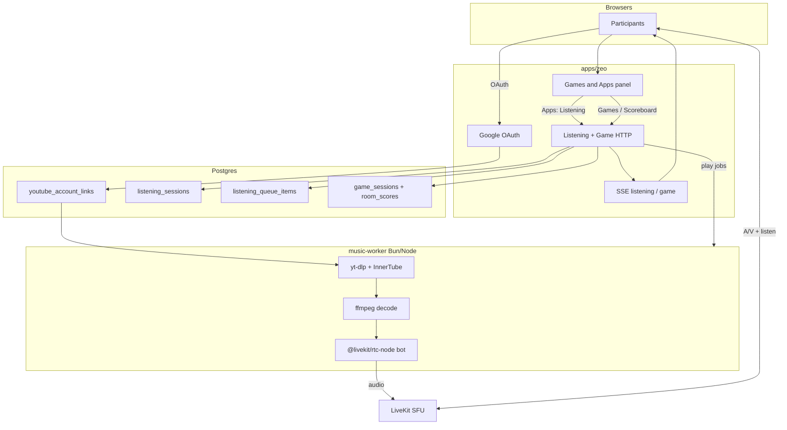

# Zeo Shared Listening — Planning Decisions (Discord-bot model)

**Status:** Decisions locked 2026-07-25 (pending implementation spike)  
**Date:** 2026-07-25  
**Scope:** First **App** under in-call **Games and Apps**: shared YouTube listening via stream extract + LiveKit relay  
**Extends:** zeo LiveKit rooms + game-mode shell (panel → Games and Apps) + SSE/HTTP patterns

---

## 0. Path lock

**Chosen model:** Discord music bot style — not IFrame sync, not headless Chrome UI automation.

| Piece | Choice |
|-------|--------|
| Shell | Control bar **Games and Apps** panel with tabs **Apps · Games · Scoreboard** |
| First app | **Shared Listening** (catalog entry under Apps) |
| Identity | **One linker** connects Google / YouTube; session keeps using **that** account even if DJ controls hand off |
| Library | YT playlists + Liked **and** YT Music library/search (both in scope) |
| Playback | yt-dlp / InnerTube resolve → decode → **LiveKit bot audio track** |
| Controls | Queue + transport in zeo (server-authoritative) |
| Failures | **Auto-skip** unplayable tracks after a short delay |

### Honest risk (accepted)

Violates YouTube ToS (extract + redistribute) — same gray area as Discord music bots. Expect extractor breakage, account friction, ongoing maintenance. Personal/friend-group product only; do not market as official YouTube.

---

## 1. Locked decisions (including answered open questions)

| Topic | Decision |
|-------|----------|
| Product placement | **Games and Apps** → **Apps** tab → Shared Listening (first app) |
| Who may start Listen | **Any authenticated participant** (not host-only), if they can link/use Google |
| Google / stream identity | **Original linker’s** tokens for the whole session (DJ handoff does **not** switch credentials) |
| DJ controls | Starter is DJ; may hand off transport controls to another participant; linker credentials unchanged |
| Queue adds | Any room participant |
| Library scope | **Both:** YouTube playlists/Liked (Data API) **and** YouTube Music library / ytmsearch (InnerTube) |
| Unplayable tracks | Show error briefly → **auto-skip** to next (e.g. ~3s) |
| Worker runtime | **Bun/Node `music-worker`** + `yt-dlp` + `ffmpeg` subprocesses (see §1.1) |
| Publish path | **LiveKit RTC bot** via `@livekit/rtc-node` (see §1.1); WHIP only as spike fallback |
| Audio in call | Single bot track; no YouTube ads in-call |
| Stage | `listening` tile (art, title, seek, transport); bot hidden from camera grid |
| Video relay | Out of MVP (audio-only like Discord) |
| Capacity | ≤2 rooms; one listen session + one bot per room |

### 1.1 Recommendations locked (Q3 / Q4)

**Worker = Bun/Node, not Python**

- Monorepo already Bun; shared types/env patterns stay one stack.
- `yt-dlp` and `ffmpeg` are CLI binaries either way — language only orchestrates.
- `@livekit/rtc-node` can publish `AudioSource` frames without standing up Ingress.
- Python only if the RTC spike fails badly (then thin Python agent is fine).

**Publish = LiveKit RTC bot, not WHIP**

- Pause / seek / skip stay in-process with the decoder (no re-handshake to ingress).
- Zeo deploy today treats **ingress as optional**; avoid new SFU dependency for MVP.
- Bot join/leave mirrors room listening lifecycle cleanly.
- Fallback: WHIP + ffmpeg if `@livekit/rtc-node` audio publish is blocked in spike.

---

## 2. Games and Apps shell

### 2.1 Rename & tabs

Replace in-call **Game mode** with **Games and Apps**.

| Today | Target |
|-------|--------|
| Control bar: “Game mode” | **Games and Apps** |
| Panel title: “Game mode” | **Games and Apps** |
| Tabs: Setup \| Scoreboard | **Apps \| Games \| Scoreboard** |

Primary files today: `ControlBar.svelte`, `GamePanel.svelte`, `CallExperience.svelte`.

### 2.2 Tab roles

| Tab | Audience | Content |
|-----|----------|---------|
| **Apps** | All | Catalog of room apps. MVP: **Shared Listening** card (Start / Open / Active state). Future apps land here. |
| **Games** | All (host starts) | Former Setup: Charades start/config/in-game host controls. |
| **Scoreboard** | All | Existing `roomScores` list (unchanged meaning: game scores). Listening does **not** write scoreboard rows. |

### 2.3 Interaction rules

- Opening the panel does **not** by itself change stage layout.
- Starting a **game** still forces `stageLayoutMode = "game"` (existing behavior).
- Starting **Shared Listening** does **not** use game layout; it adds a `listening` stage tile and bot audio. Mic/cam layout stays auto/grid/sidebar as now.
- Game + Listening may both be conceptually allowed later; **MVP: allow both** unless a hard conflict appears in implementation (document if we must mutex).
- Mutual exclusion with chat / devices / grid settings panels unchanged (one bottom-left panel).
- Non-host: button visible when any app or game is active **or** always visible so they can open Apps/Scoreboard — prefer **always show Games and Apps** to all participants (host-only actions still gated inside).

### 2.4 Shared Listening entry (no separate Listen control-bar button)

1. Open **Games and Apps** → **Apps**.
2. **Shared Listening** → Connect YouTube (if needed) → **Start**.
3. Panel can switch into an in-app subview (Now Playing mini + Queue / Library) **or** keep catalog + use stage tile + a dedicated sub-panel; prefer: **Apps catalog** stays list-level; **active app** expands in-panel controls (queue/library/search) while tile shows transport chrome.

---

## 3. User journeys

### UJ-1 — Link & start (any participant)
Open Games and Apps → Apps → Shared Listening → Connect Google if needed → Start → bot joins → listening tile appears.

### UJ-2 — Library (YT + YTM)
DJ/linker browses playlists, Liked, and Music library → play track or enqueue playlist items (capped).

### UJ-3 — Search & queue
Anyone searches (YT + YTM) or pastes URL → Add to queue → auto-advance; failures auto-skip.

### UJ-4 — Controls & handoff
DJ transports; may transfer DJ role; **streams still resolve with original linker’s Google**. Listeners: tile volume / listen-mute.

### UJ-5 — Late join
LiveKit bot track + SSE snapshot.

### UJ-6 — End / unlink
End from Apps (or host force-end) → bot leaves. Unlink Google kills token; active session using that link ends.

---

## 4. Functional requirements (draft)

### 4.1 Shell
- **FR-GA-1:** Control bar opens **Games and Apps** panel.
- **FR-GA-2:** Panel has tabs **Apps**, **Games**, **Scoreboard**.
- **FR-GA-3:** Apps lists Shared Listening as first app with idle/active actions.
- **FR-GA-4:** Games tab preserves Charades host/player flows previously under Setup.
- **FR-GA-5:** Scoreboard tab unchanged data source (`roomScores`).

### 4.2 Account linking
- **FR-SL-1:** Google OAuth with YouTube scopes (+ whatever InnerTube needs via refresh/cookies derived from link).
- **FR-SL-2:** Refresh tokens encrypted at rest.
- **FR-SL-3:** Disconnect deletes tokens and ends sessions that depend on them.
- **FR-SL-4:** Session stores `linker_user_id`; worker always uses linker credentials.

### 4.3 Library & search
- **FR-SL-5–8:** Playlists, playlist items, Liked, URL parse (as before).
- **FR-SL-9:** YTM library + ytmsearch in **Phase 1** (best-effort resilience; degrade UI section if InnerTube down, keep YT playlists working).
- **FR-SL-9b:** Unified search UI can show mixed YT / Music results with source badges.

### 4.4 Playback worker
- **FR-SL-10–13:** Resolve, publish bot audio, pause/seek/skip, end → next.
- **FR-SL-14:** On resolve/play failure → error on tile/SSE → **auto-skip after ~3s** (configurable).

### 4.5 Queue & session
- **FR-SL-15–18:** Server queue, cap 50, duplicates OK, one session per room.
- **FR-SL-19:** Any participant may start session (must complete Google link if none / if required to be linker).
- **FR-SL-20:** Starting participant becomes linker + initial DJ.

### 4.6 UI
- **FR-SL-21:** Listening stage tile + in-panel queue/library/search when app active.
- **FR-SL-22:** Source badge + added-by on queue rows.
- **FR-SL-23:** No dedicated control-bar Listen button (entry via Apps).

---

## 5. Architecture



### 5.1 Worker & publish

| Choice | Detail |
|--------|--------|
| Package | e.g. `apps/zeo-music-worker` or `apps/zeo/worker-music` |
| Runtime | Bun (or Node if rtc-node requires it) |
| Resolve | `yt-dlp` with linker cookie/OAuth jar; InnerTube helpers for YTM library |
| Decode | `ffmpeg` → PCM s16le 48k mono/stereo |
| Publish | `@livekit/rtc-node` room connect as `listening-bot:{roomId}`, `AudioSource` → track |
| Concurrency | Max 1 job per room, max 2 rooms |

### 5.2 Schema sketch

```
youtube_account_links (per user)
listening_sessions
  linker_user_id   -- credentials
  dj_user_id       -- who can transport
  …
listening_queue_items
```

Game tables unchanged; scoreboard stays game-only.

### 5.3 API sketch

- OAuth link/unlink under `/api/me/youtube-link` (+ callback)
- Listening under `/api/rooms/[slug]/listening/*` (start/end/events/queue/play/…)
- Library: `/listening/library/playlists`, `…/items`, `/listening/library/music/*`, `/listening/search`
- Games APIs unchanged paths; panel only renamed

---

## 6. Phasing

### Phase 0 — Spike (gate)
OAuth (or cookie export path) → yt-dlp one track → `@livekit/rtc-node` bot audible in a test room on target-like hardware. Go/no-go.

### Phase 1a — Shell
Rename Game mode → **Games and Apps**; tabs Apps / Games / Scoreboard; move Charades into Games.

### Phase 1b — Listening MVP
Link Google, start/stop from Apps, search + URL + YT playlists/Liked, queue, transport, bot audio, auto-skip, listening tile.

### Phase 1c — YTM library
Music library browse + ytmsearch hardening (PO token / client rotation as needed).

### Phase 2
DJ handoff polish, playlist enqueue-all (capped), richer app catalog metadata, worker health banner.

### Non-goals
- Official YouTube partnership framing
- WHIP/ingress unless spike forces it
- Video relay
- Scoreboard integration for listening
- Separate control-bar Listen button

---

## 7. Risks

| Risk | Plan |
|------|------|
| Extractors break | Update yt-dlp; feature-flag App; maintenance copy in Apps card |
| YTM InnerTube flaky | Degrade Music section; keep Data API playlists |
| KVM 2 CPU | Cap 2 bots; monitor; Opus/PCM efficiency |
| Token security | Encrypt at rest; never to clients |
| Game+Listen UX clash | Ship both; mutex later only if needed |

---

## 8. Open questions — resolved

| # | Question | Resolution |
|---|----------|------------|
| 1 | DJ handoff credentials | **Original linker** |
| 2 | Non-host start | **Yes** |
| 3 | Worker runtime | **Bun/Node + yt-dlp/ffmpeg** |
| 4 | Publish path | **LiveKit RTC bot** (`@livekit/rtc-node`) |
| 5 | YTM library | **Both** YT + YTM in scope |
| 6 | Auto-skip | **Yes** (~3s) |

---

## 9. Next steps

1. **Spike** (Phase 0) — prove resolve + bot audio  
2. **SPEC** `shared-listening` (+ companion for Games and Apps shell) **or** short PRD addendum  
3. Implement shell rename (1a) in parallel with spike if desired  
4. Architecture note: `architecture-shared-listening.md` (worker deploy beside LiveKit)
